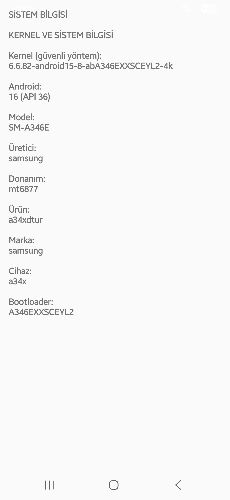

# SystemInfoReader 📱

**SystemInfoReader**, Android cihazınızın temel sistem bilgilerini hızlı ve basit bir şekilde görüntüleyen bir uygulamadır. Kernel sürümü, Android versiyonu, cihaz modeli, üretici bilgisi ve bootloader durumu gibi temel donanım ve sistem bilgilerini gösterir.

---

## Özellikler ✨
- Kernel sürümü okuma (güvenlik izinlerine göre)
- Android sürümü, model, üretici ve donanım bilgisi görüntüleme
- Bootloader durumu gösterimi
- Kullanıcı dostu arayüz ve basit butonlarla kolay kullanım

---

## Desteklenen Android Sürümleri 📌
- Minimum Android 7.0 (API 24)
- Target SDK: Android 13 (API 36)

---

## Kurulum ve Kullanım 🚀
1. APK’yı cihazınıza yükleyin
2. Uygulamayı açın
3. Sistem bilgileri ana ekranda görüntülenecektir

> **Not:** Kernel bilgisi bazı cihazlarda güvenlik nedeniyle okunamayabilir.

---

## Ekran Görüntüsü 📸

---

## Lisans 📄
Bu proje MIT lisansı altında dağıtılmaktadır. Daha fazla bilgi için [LICENSE](LICENSE) dosyasına bakabilirsiniz.
